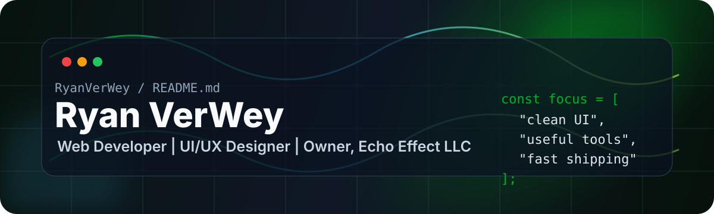
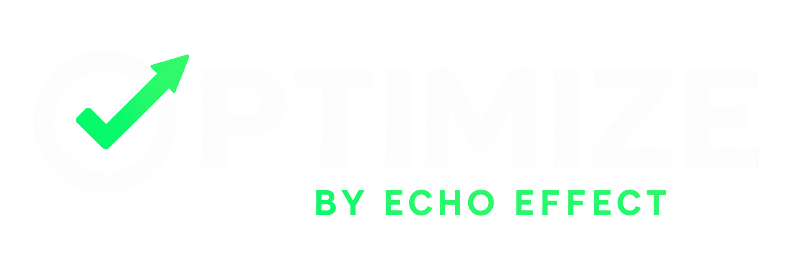
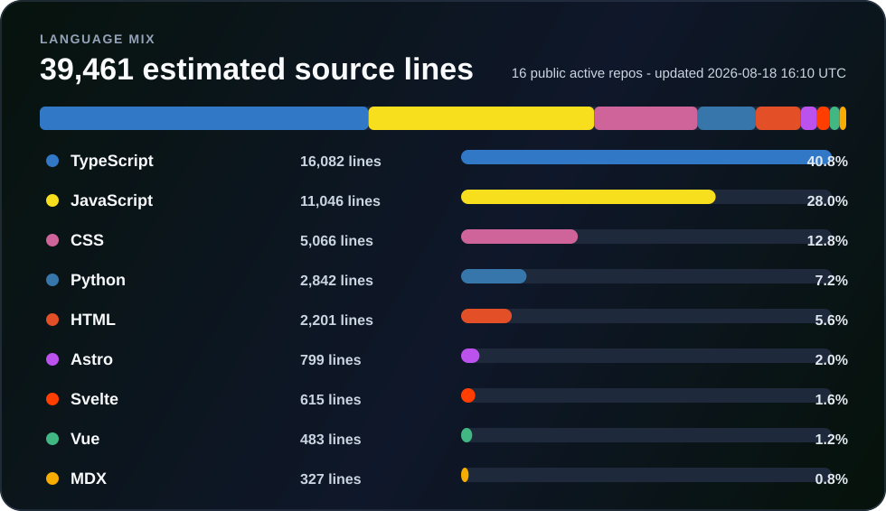

---

## RyanVerWey / README.md

# Hi, I'm Ryan VerWey

### Chief Technology Officer, Ratespedia LLC | Creator of Optimize | Owner, Echo Effect LLC

I build practical web products, UI systems, and small tools that make real workflows easier.

- Based in Tampa, FL and working remote.
- Chief Technology Officer at Ratespedia LLC.
- Building client-facing web experiences through [Echo Effect LLC](https://www.echoeffect.net/).
- Creator of [Optimize by Echo Effect](https://www.echoeffect.net/optimize), a website audit tool for SEO, AEO, GEO, crawler access, structured data, WCAG, and ADA-readiness signals.
- Studied at Full Sail University.
- Interested in clean interfaces, automation, SEO tooling, content systems, and developer experience.
- Open to useful collaborations, especially web apps, UI libraries, AI-assisted workflows, and open-source tools.

## Optimize by Echo Effect

**Website audits for SEO, AEO, GEO, crawler access, structured data, WCAG, and ADA-readiness signals.**

## Skills

  
  
  
  
  
  
  
  
  
  
  
  
  
  
  
  
  
  
  
  

## Language mix

## Contribution snake

<picture>
  <source media="(prefers-color-scheme: dark)" srcset="https://raw.githubusercontent.com/RyanVerWey/RyanVerWey/output/github-contribution-grid-snake-dark.svg" />
  <source media="(prefers-color-scheme: light), (prefers-color-scheme: no-preference)" srcset="https://raw.githubusercontent.com/RyanVerWey/RyanVerWey/output/github-contribution-grid-snake.svg" />
  
</picture>

---

**Clean UI. Useful tools. Ship, learn, improve.**

<!-- Profile README enabled for RyanVerWey/RyanVerWey. -->
